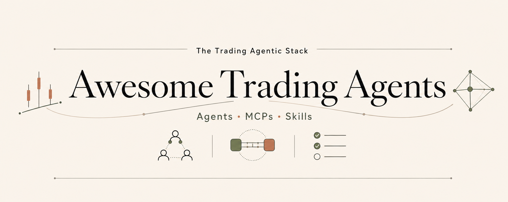

<!--lint disable no-file-name-mixed-case awesome-heading double-link awesome-list-item-->

<a href="README.md">English</a> · <strong>简体中文</strong>

  
  
  
  
  
  

Awesome Trading Agents 收集开源项目：这些项目用 LLM 做市场研究、交易决策，或帮助 Agent 连接行情、研究工具和交易执行。清单围绕三类项目：Agents、MCPs、Skills。我们不覆盖传统量化库、时间序列模型、强化学习交易机器人；这些更适合看 [`georgezouq/awesome-ai-in-finance`](https://github.com/georgezouq/awesome-ai-in-finance) 和 [`wilsonfreitas/awesome-quant`](https://github.com/wilsonfreitas/awesome-quant)。收录时主要看：是否有公开代码或技术材料、LLM 是否参与核心流程、是否还在维护、文档是否清楚、和现有项目是否有明显区别、是否有公开使用信号。维护方为 [LLMQuant](https://llmquant.com) 社区。

> [!TIP]
> **如果你只读三个：**
>
> - **Agents** — [TauricResearch/TradingAgents](#agents-tradingagents) · [virattt/ai-hedge-fund](#agents-ai-hedge-fund) · [HKUDS/AI-Trader](#agents-ai-trader)
> - **MCPs** — [alpacahq/alpaca-mcp-server](#mcps-alpaca) · [krakenfx/kraken-cli](#mcps-kraken-cli) · [financial-datasets/mcp-server](#mcps-financial-datasets)
> - **Skills** — [tradermonty/claude-trading-skills](#skills-claude-trading-skills) · [himself65/finance-skills](#skills-finance-skills) · [RKiding/Awesome-finance-skills](#skills-alphaear)

> [!NOTE]
> 不在每条后面显示日期。我们添加或更新项目时仍会检查近期活跃度；README 只保留帮助读者判断的稳定信息，比如官方项目、fork 关系和推荐搭配。

## 目录

- [**Agents**](#agents)
  - [Multi-agent trading systems](#agents-multi-agent)
  - [Single-agent end-to-end traders](#agents-single-agent)
  - [Research / equity-research copilots](#agents-research-copilots)
  - [Real-money / competition experiments](#agents-real-money)
  - [Prediction-market specialists](#agents-prediction-market)
  - [Benchmarks & evaluations](#agents-benchmarks)
  - [Strategy coding / self-improving agents](#agents-strategy-coding)
- [**MCPs**](#mcps)
  - [Market data / data providers](#mcps-market-data)
  - [Brokerage / exchange trading](#mcps-brokerage)
  - [Research tools / analysis](#mcps-research-tools)
  - [TradingView bridge](#mcps-tradingview)
  - [Prediction markets](#mcps-prediction-market)
  - [Strategy / backtesting platforms](#mcps-backtesting)
- [**Skills**](#skills)
  - [Equity research](#skills-equity-research)
  - [Crypto / DeFi / on-chain](#skills-crypto)
  - [Strategy coding & backtesting](#skills-strategy-coding)
  - [Brokerage execution & portfolio](#skills-brokerage)
- [**Resources**](#resources)
  - [Papers](#resources-papers)
  - [Learn](#resources-learn)
- [Related awesome lists](#related-awesome-lists)

## Agents

  

Agents 是 LLM 参与市场研究或交易决策的项目，包括分析师团队、单 Agent 交易者、投研助手、实盘实验、评测和策略生成工具。TradingAgents 的几个 fork 与原项目放在同一层级，方便连续浏览。

### Multi-agent trading systems

- [TauricResearch/TradingAgents](https://github.com/TauricResearch/TradingAgents) - Multi-agent 交易框架；分析师、看多 / 看空研究员、交易员、风控和组合经理一起讨论后给出决策；基于 LangGraph。
- [hsliuping/TradingAgents-CN](https://github.com/hsliuping/TradingAgents-CN) - TradingAgents 的中文与 A 股本地化加强分支；接入 Tushare / AkShare 数据源 + 中文报告 + A 股监管语境。 *(← fork of TauricResearch/TradingAgents.)*
- [KylinMountain/TradingAgents-AShare](https://github.com/KylinMountain/TradingAgents-AShare) - A 股专项重写；15 个 Agent + 可视化界面 + OpenClaw / Claude Code 集成 + Docker 一键部署。 *(← fork of TauricResearch/TradingAgents.)*
- [oficcejo/aiagents-stock](https://github.com/oficcejo/aiagents-stock) - A 股 Multi-agent 分析师团队；龙虎榜跟踪 + 板块轮动告警 + miniqmt 量化执行钩子。 *(← inspired by TradingAgents.)*

- [HKUDS/AI-Trader](https://github.com/HKUDS/AI-Trader) - "Agent-Native Trading Platform"；任意 AI Agent（OpenClaw / nanobot / Claude Code / Codex / Cursor）通过 SKILL.md 注册并经 AI4trade.ai 实盘交易；多资产 + 复制交易 + 跨平台同步。
- [ValueCell-ai/valuecell](https://github.com/ValueCell-ai/valuecell) - 社区金融工作台；包含研究、策略和新闻 Agent；连接 Binance / OKX / Hyperliquid，并提供 macOS / Windows 桌面版。
- [AI4Finance-Foundation/FinRobot](https://github.com/AI4Finance-Foundation/FinRobot) - AI4Finance 基金会的开源 finance AI Agent 平台；适合看学术取向的股票研究、市场预测和报告生成。

- [HKUDS/Vibe-Trading](https://github.com/HKUDS/Vibe-Trading) - HKUDS 实验室的个人 Multi-agent 金融工作台；内置 Skills、MCP tools 和 swarm presets，覆盖 A 股 / HK / US / 加密 / 期货 / 外汇。
- [brokermr810/QuantDinger](https://github.com/brokermr810/QuantDinger) - 开源 AI 量化交易平台；把 Multi-agent 研究、回测、实盘和多交易所路由放在一套流程里。
- [Lumiwealth/lumibot](https://github.com/Lumiwealth/lumibot) - 可回测的 AI trading Agent / team runtime；内置研究、Bull / Bear 辩论、风控和记忆，同一策略循环可用于回测、模拟盘与实盘。
- [The-Swarm-Corporation/AutoHedge](https://github.com/The-Swarm-Corporation/AutoHedge) - "几分钟启动一支自治对冲基金"；把 Swarms 框架用于市场分析、风控和执行；CLI / SDK 优先。
- [olaxbt/ai-market-maker](https://github.com/olaxbt/ai-market-maker) - Agentic 加密 hedge-fund 栈；多交易员 Agent + Risk Guard + 回测 + paper trading + OpenClaw packaging。

- [ginlix-ai/LangAlpha](https://github.com/ginlix-ai/LangAlpha) - "面向金融的 Claude Code"；LangChain + LangGraph Multi-agent 投资工作台；一个仓库里同时提供 Agents、MCPs 和 Skills。
- [ygwyg/MAHORAGA](https://github.com/ygwyg/MAHORAGA) - TypeScript 自治加密交易 Agent；主打社交情绪分析和自适应学习；适合想看 TypeScript 实现的读者。
- [FinStep-AI/ContestTrade](https://github.com/FinStep-AI/ContestTrade) - Multi-agent 交易系统；多个 Agent 内部竞争，最后选出一个观点进入最终决策。
- [51bitquant/ai-hedge-fund-crypto](https://github.com/51bitquant/ai-hedge-fund-crypto) - virattt/ai-hedge-fund 的加密专项分支；多时间框架分析 + 策略集成 + 加密市场数据接入。

- [dragon1086/prism-insight](https://github.com/dragon1086/prism-insight) - 聚焦韩国市场的 Multi-agent 股票分析与交易系统；内置 MCP 集成。
- [Tomortec/CryptoTradingAgents](https://github.com/Tomortec/CryptoTradingAgents) - Multi-agent LLM 加密交易框架；把 TradingAgents 的思路改到加密交易上。
- [EthanAlgoX/LLM-TradeBot](https://github.com/EthanAlgoX/LLM-TradeBot) - Multi-agent 加密交易系统；Binance 实时执行 + 自适应策略切换；结合 TradingAgents 和 nof1.ai 两类项目的做法。
- [huygiatrng/AlpacaTradingAgent](https://github.com/huygiatrng/AlpacaTradingAgent) - TradingAgents 风格的 Multi-agent 框架，连接 Alpaca 做美股交易。 *(→ pairs with: [alpacahq/alpaca-mcp-server](#mcps-alpaca).)*
- [Yaolinwang/AITD](https://github.com/Yaolinwang/AITD) - "AI Trading Agent for Everyone"；面向散户设计的 Multi-agent 项目。
- [flash131307/multi-agent-investment](https://github.com/flash131307/multi-agent-investment) - Multi-agent 股票研究系统；LLM Agent 负责收集证据，另一个数学层把信号合成 BUY / NEUTRAL / SELL。

- [YichengYang-Ethan/oracle3](https://github.com/YichengYang-Ethan/oracle3) - 多场地（Kalshi / Polymarket / Solana）prediction-market autonomous Agent；Wang-Transform 定价 + Kelly 准则 + 跨场地套利。
- [Ganador1/FenixAI_tradingBot](https://github.com/Ganador1/FenixAI_tradingBot) - LangGraph + Ollama + CrewAI 自治交易 Agent；本地 LLM 优先。
- [ryan-yuuu/crypto-trading-arena](https://github.com/ryan-yuuu/crypto-trading-arena) - 开源加密交易竞技场；Claude / Claude Code Agent 在实时加密数据上互相比拼。
- [FareedKhan-dev/multi-agent-trading-system](https://github.com/FareedKhan-dev/multi-agent-trading-system) - "Deep Thinking Trading System" 教程实现；初学者友好的 Multi-agent 示例设计。
- [Tanglumy/Finance-Bro](https://github.com/Tanglumy/Finance-Bro) - Persona 风格的金融"老哥"交易投资 Agent；把人设作为核心交互方式。
- [liangdabiao/autogen-financial-analysis](https://github.com/liangdabiao/autogen-financial-analysis) - Microsoft AutoGen Multi-agent 金融分析系统；VaR / 蒙特卡洛 / 因子模型 / 可视化集成。

> [!NOTE]
> 这里也值得看：[guangxiangdebizi/TradingAgents-MCPmode](#mcps-tradingagents-mcpmode) 把 TradingAgents 风格的研究流程做成 MCP tools。完整介绍放在 MCPs · Research tools / analysis。

> 也可以看：[chrisworsey55/atlas-gic](#agents-atlas-gic) 放在 Single-agent end-to-end traders，但它用持续研究和改进策略来取代多 Agent 辩论，和这里的系统很接近。

### Single-agent end-to-end traders

- [virattt/ai-hedge-fund](https://github.com/virattt/ai-hedge-fund) - 广泛 fork 的 LLM 驱动股票交易仓库；多个分析师 persona（巴菲特 / 芒格 / 木头姐）提议，组合经理决断。
- [TraderAlice/OpenAlice](https://github.com/TraderAlice/OpenAlice) - "你的一人华尔街"；单 Agent 覆盖研究 → 入场 → 持仓 → 出场；Claude Agent SDK + Trading-as-Git 审批工作流 + 跨资产 UTA 账户设计。

- [NoFxAiOS/nofx](https://github.com/NoFxAiOS/nofx) - 自托管 LLM 交易终端；模型负责读取市场、决策并记录推理，Go runtime 强制硬风控；支持 9 个交易所和多模型排行榜。

- [chrisworsey55/atlas-gic](https://github.com/chrisworsey55/atlas-gic) - General Intelligence Capital 自我改进交易 Agent；重点是持续研究和改进策略，而不是让多个 Agent 辩论。
- [Gajesh2007/ai-trading-agent](https://github.com/Gajesh2007/ai-trading-agent) - Hyperliquid 上的 AI 交易 Agent；单 LLM 驱动执行；展示如何直接接入 Hyperliquid。
- [kweinmeister/agentic-trading](https://github.com/kweinmeister/agentic-trading) - Google ADK + A2A 互通的交易工作流示例；提供 LangGraph 之外的另一种实现方式。
- [danilobatson/ai-trading-agent-gemini](https://github.com/danilobatson/ai-trading-agent-gemini) - LunarCrush 社交情绪 + Google Gemini 加密交易 Agent；使用 Next.js 15、Inngest 和 Supabase。
- [alsk1992/CloddsBot](https://github.com/alsk1992/CloddsBot) - 覆盖 1000+ 市场的开源 AI 交易 Agent，包括 Polymarket、Kalshi、Binance、Hyperliquid、Solana 和多个 EVM 链。
- [hkirat/ai-trading-agent](https://github.com/hkirat/ai-trading-agent) - "Trade using LLMs"；Harkirat Singh 的极简 TypeScript 演示；适合 TS 学习者快速上手。

### Research / equity-research copilots

- [ZhuLinsen/daily_stock_analysis](https://github.com/ZhuLinsen/daily_stock_analysis) - 每日 LLM 驱动选股仪表盘；微信 / 飞书 / Telegram / Discord / Slack / 邮件多渠道推送；11 内置策略 + Agent 问股策略对话；GitHub Actions 即部署。
- [AmadeusGB/alpha-arena](https://github.com/AmadeusGB/alpha-arena) - 实盘 AI Agent 竞赛和研究平台；用真实市场条件迭代 Agent。
- [TNT-Likely/PanWatch](https://github.com/TNT-Likely/PanWatch) - "盯盘侠"；AI 驱动的股票监控助手；多账户持仓 + Agent 分析 + PWA 移动端。
- [YoungCan-Wang/WyckoffTradingAgent](https://github.com/YoungCan-Wang/WyckoffTradingAgent) - A/HK/US 股票分析助手；用威科夫量价逻辑生成 AI 报告，并提供 CLI、Web 和 MCP tools。
- [HKUSTDial/DeepEar](https://github.com/HKUSTDial/DeepEar) - "顺风耳"；HKUSTDial 开源的金融深度研究与信号跟踪框架；多模态新闻 + 价格联合追踪。
- [kamathhrishi/finance-agent](https://github.com/kamathhrishi/finance-agent) - 财报电话会议 / SEC 文件 / 新闻问答 Agent；清晰的 RAG-over-disclosures 实现。

> 也相关：[ginlix-ai/LangAlpha](#agents-langalpha) 和 [oficcejo/aiagents-stock](#agents-tradingagents) 都有投研助手界面，但它们的主项目更像完整的 Multi-agent 系统，所以放在前面。

### Real-money / competition experiments

- [LuckyOne7777/LLM-Trading-Lab](https://github.com/LuckyOne7777/LLM-Trading-Lab) - 真金白银 6 个月实验；ChatGPT 在严格预定义规则下管理一个真实美股微盘组合；附 40 页评估论文。
- [195440/nof1.ai](https://github.com/195440/nof1.ai) - nof1 系列的开源自治 AI 交易 Agent；TypeScript 移植版。
- [oficcejo/alpha-arena-okx](https://github.com/oficcejo/alpha-arena-okx) - nof1.ai Alpha Arena 的 OKX 重实现；DeepSeek / Qwen3-Max 担任决策者；适合看 nof1 中文衍生项目。
- [wquguru/nof0](https://github.com/wquguru/nof0) - nof1.ai Alpha Arena 高热度复刻；Go 后端 + Next.js 前端，接 Hyperliquid、LLM executor、回测和排行榜。

> 也可以看：[NoFxAiOS/nofx](#agents-nofx) 支持多个 LLM trader 并行运行和排行榜；完整介绍放在 Single-agent end-to-end traders，因为它首先是一套完整交易终端。

### Prediction-market specialists

- [ryanfrigo/kalshi-ai-trading-bot](https://github.com/ryanfrigo/kalshi-ai-trading-bot) - Grok-4 驱动的 Kalshi prediction-market Multi-agent 交易系统；组合优化 + 5-gate 风控引擎。
- [OctagonAI/kalshi-trading-bot-cli](https://github.com/OctagonAI/kalshi-trading-bot-cli) - 面向 Kalshi / Polymarket 的 AI-native CLI；研究事件、估算概率，再和实时订单簿对比寻找机会。
- [jvnhaoWen/PolyAgent](https://github.com/jvnhaoWen/PolyAgent) - 面向 Polymarket 的 multi-Skill trading Agent；聚焦单一 prediction-market 平台。

> 这里也值得看：[agent-next/polymarket-paper-trader](#mcps-polymarket-paper-trader) 放在 MCPs，因为它是纸面交易模拟器；但它本来就是为 AI Agent 准备的。

> 也可以看：[YichengYang-Ethan/oracle3](#agents-oracle3) 放在 Multi-agent 系统里，但它的多场地 prediction-market arbitrage 对这个小类也很相关。

### Benchmarks & evaluations

- [ulab-uiuc/live-trade-bench](https://github.com/ulab-uiuc/live-trade-bench) - 面向交易 Agent 的 live-market 评测；UIUC ULab 实验室项目；区别于只看历史回测的 benchmark。
- [Open-Finance-Lab/AgenticTrading](https://github.com/Open-Finance-Lab/AgenticTrading) - Open-Finance-Lab 学术框架 + 数据集，面向 Agent 交易研究。
- [vals-ai/finance-agent](https://github.com/vals-ai/finance-agent) - vals-ai 出品的金融 Agent benchmark / task 套件。

- [HKUSTDial/DeepFund](https://github.com/HKUSTDial/DeepFund) - 多 Agent 基金投资评测；LLM 分析师在统一交易竞技场内产生信号并通过排行榜对比。

### Strategy coding / self-improving agents

- [HammerGPT/Hyper-Alpha-Arena](https://github.com/HammerGPT/Hyper-Alpha-Arena) - LLM 因子研究与永续交易平台；86 个内置因子 + IC / ICIR / 衰减评估，可从论文挖掘并验证新因子，再用于回测或交易。
- [paperswithbacktest/pwb-alphaevolve](https://github.com/paperswithbacktest/pwb-alphaevolve) - DeepMind AlphaEvolve 风格的策略生成 Agent；用 LLM 编写和改进交易策略，再用于回测。
- [Miasyster/QuantGPT](https://github.com/Miasyster/QuantGPT) - Agent 原生的 A 股多因子研究引擎；8 个 MCP 工具覆盖 因子设计 → 回测 → 评分 → 反过拟合 → WQ BRAIN 提交。*(与 rnikitin/QuantGPT 同名但是两个不同项目。)*

> 注：[`TauricResearch/Trading-R1`](https://github.com/TauricResearch/Trading-R1) 目前还没有公开可用的 terminal，所以暂不列入；等项目可用后可以在下一轮维护中加入。

## MCPs

  

MCPs 是让 Agent 通过 Model Context Protocol 调用外部工具的服务。在这份清单里，它们主要负责行情数据、券商或交易所操作、研究工具和回测服务。

> [!NOTE]
> 同一作者的两个项目：`guangxiangdebizi/` 维护 [FinanceMCP](#mcps-financemcp) 做数据访问，也维护 [TradingAgents-MCPmode](#mcps-tradingagents-mcpmode) 做 TradingAgents 风格的研究工具。它们解决的问题不同，所以放在不同小类。

### Market data / data providers

- [LLMQuant/data-mcp](https://github.com/LLMQuant/data-mcp) - LLMQuant Data 官方 MCP server，定位为 "AI-native 金融的 knowledge harness"；覆盖 5 万+ 量化 wiki 词条与 1200+ 研究论文的语义检索、美股日频 OHLCV + 分红/拆股、加密货币 K 线与实时快照（Binance Spot）、50+ 精选宏观指标（FRED 等）、SEC 10-K/10-Q 全文浏览与分节阅读，以及 13F 机构持仓三向查询（manager → 持仓 / ticker → 持有人 / top managers 排名）。
- [financial-datasets/mcp-server](https://github.com/financial-datasets/mcp-server) - Financial Datasets 厂商官方 MCP；美股 + 加密的基本面（三表 + 比率）+ 价格 + 新闻。
- [6551Team/opennews-mcp](https://github.com/6551Team/opennews-mcp) - 84+ 信源聚合（Bloomberg / Reuters / FT / CoinDesk 等）+ AI 评定的影响打分 / 交易信号 + WebSocket 流。
- [BlockRunAI/blockrun-mcp](https://github.com/BlockRunAI/blockrun-mcp) - 按调用计费的实时数据 MCP，使用 x402 微支付；覆盖搜索、研究、行情、加密、X / Twitter。

- [guangxiangdebizi/FinanceMCP](https://github.com/guangxiangdebizi/FinanceMCP) - Tushare + Binance MCP 横跨 A 股 / HK / 美股 / 基金 / 债券 / 宏观 / 稳定币 / 加密 / 财经新闻。
- [chengzuopeng/stock-sdk](https://github.com/chengzuopeng/stock-sdk) - 零依赖 TypeScript 股票数据 SDK + 内置 MCP server；覆盖 A / H / 美股和公募基金，支持 Browser / Node.js、CLI 与 Claude Code / Codex。
- [saidsurucu/borsa-mcp](https://github.com/saidsurucu/borsa-mcp) - 土耳其 BIST + 美股 + 基金数据 MCP；覆盖非中美区域市场。
- [aahl/mcp-aktools](https://github.com/aahl/mcp-aktools) - 基于 akshare / aktools 的股票与加密数据 MCP；通过 AKShare 生态覆盖较广的市场数据。
- [elsejj/mcp-cn-a-stock](https://github.com/elsejj/mcp-cn-a-stock) - A 股专项数据 MCP；聚焦单市场高覆盖度，区别于多源聚合器。
- [massive-com/mcp_massive](https://github.com/massive-com/mcp_massive) - Massive（前 Polygon.io 品牌）厂商官方 MCP；多资产行情数据覆盖。
- [Alex2Yang97/yahoo-finance-mcp](https://github.com/Alex2Yang97/yahoo-finance-mcp) - 全功能 Yahoo Finance MCP；历史价 + 基本面 + 期权链 + 新闻；Yahoo Finance 封装。
- [stefanoamorelli/sec-edgar-mcp](https://github.com/stefanoamorelli/sec-edgar-mcp) - SEC EDGAR MCP；读取 10-K / 10-Q / 8-K、内部交易和 filings；常用来读取美股公告数据。
- [zwldarren/akshare-one-mcp](https://github.com/zwldarren/akshare-one-mcp) - AKShare-One 归一化器加持的 A 股数据 MCP；AKShare 生态里的另一种实现。
- [imbenrabi/Financial-Modeling-Prep-MCP-Server](https://github.com/imbenrabi/Financial-Modeling-Prep-MCP-Server) - FMP MCP，提供 250+ 工具，覆盖基本面、市场洞察和 ETF。
- [narumiruna/yfinance-mcp](https://github.com/narumiruna/yfinance-mcp) - 极简 yfinance MCP；获取 Yahoo Finance 数据的轻量选择。
- [OctagonAI/octagon-mcp-server](https://github.com/OctagonAI/octagon-mcp-server) - 文件 / 财报会议 / 财务 / 股票数据 / 私募交易 / 网络研究；覆盖私募市场交易与 VC 数据。
- [daniel3303/Equibles](https://github.com/daniel3303/Equibles) - 自部署金融数据中转站；把 SEC / FRED / Yahoo / FINRA / CFTC / CBOE 数据同步到 PostgreSQL，再通过 MCP 给 Agent 查询。

### Brokerage / exchange trading

- [alpacahq/alpaca-mcp-server](https://github.com/alpacahq/alpaca-mcp-server) - Alpaca 官方 MCP；提供行情，并支持股票、ETF、期权和加密的纸面或实盘交易。 *(← used by: [tradermonty/claude-trading-skills](#skills-claude-trading-skills), [staskh/trading_skills](#skills-trading-skills), [huygiatrng/AlpacaTradingAgent](#agents-tradingagents).)*

- [krakenfx/kraken-cli](https://github.com/krakenfx/kraken-cli) - Kraken 官方 AI-native CLI，内置 MCP；覆盖加密、xStocks、外汇、衍生品、纸面交易，并附带 SKILL.md packages。

- [koreainvestment/open-trading-api](https://github.com/koreainvestment/open-trading-api) - 韩国投资证券 KIS 官方 SDK；包含 Trading MCP、strategy builder 和 backtester。
- [okx/agent-trade-kit](https://github.com/okx/agent-trade-kit) - OKX 官方 MCP；覆盖现货、永续、期货、期权和网格机器人。
- [ariadng/metatrader-mcp-server](https://github.com/ariadng/metatrader-mcp-server) - MT5 MCP；让 LLM 通过任意 MetaTrader 5 经纪商交易；面向主流零售外汇平台的 MCP 连接器。
- [Qoyyuum/mcp-metatrader5-server](https://github.com/Qoyyuum/mcp-metatrader5-server) - 另一个 MT5 MCP；提供行情、交易和历史数据，并同时使用 MCP resources 与 tools。
- [rcontesti/IB_MCP](https://github.com/rcontesti/IB_MCP) - IBKR MCP；把 Interactive Brokers TWS / Gateway 暴露为 MCP 工具；面向专业经纪商场景。
- [code-rabi/interactive-brokers-mcp](https://github.com/code-rabi/interactive-brokers-mcp) - 替代 IBKR MCP；TS / JS 实现，与 rcontesti Python 版互补。
- [taylorwilsdon/quantconnect-mcp](https://github.com/taylorwilsdon/quantconnect-mcp) - 独立 QuantConnect MCP；重点是策略研究和工作流自动化。

> 如果你在看 Skills，也可以看 [krakenfx/kraken-cli](#mcps-kraken-cli)：它附带 50 个 SKILL.md packages。完整介绍放在这里，因为它主要是交易所交易工具。

### Research tools / analysis

- [wshobson/maverick-mcp](https://github.com/wshobson/maverick-mcp) - 个人股票分析 MCP；覆盖基本面、技术指标和选股。
- [mnemox-ai/tradememory-protocol](https://github.com/mnemox-ai/tradememory-protocol) - 给交易 Agent 用的 MCP "交易记忆本"；提供 17 个 MCP 工具和 35+ REST 接口，把每次为什么做决定、后来结果怎样、复盘证据在哪里都记下来。

- [guangxiangdebizi/TradingAgents-MCPmode](https://github.com/guangxiangdebizi/TradingAgents-MCPmode) - TradingAgents 重构为 MCP 工具的 Multi-agent 股票研究框架。
- [QuantMLResearch/AI-Kline](https://github.com/QuantMLResearch/AI-Kline) - 股票分析工具；结合经典技术分析、AI 预测和 MCP 访问。
- [wbsu2003/stock-scanner-mcp](https://github.com/wbsu2003/stock-scanner-mcp) - 股票扫描 MCP；提供价格、评分、技术报告和 AI 摘要。

> 也相关：[dragon1086/prism-insight](#agents-prism-insight) 放在 Agents；这里提到它，是因为它内置 MCP 支持，适合研究工具场景。

### TradingView bridge

- [atilaahmettaner/tradingview-mcp](https://github.com/atilaahmettaner/tradingview-mcp) - 30+ 工具 TradingView MCP；6 回测策略 + Reddit 情绪 + 新闻 + 多交易所；许多工具无需 API key。

### Prediction markets

- [caiovicentino/polymarket-mcp-server](https://github.com/caiovicentino/polymarket-mcp-server) - 45 工具 Polymarket MCP；实时监控 + 显式下单安全保护。

- [agent-next/polymarket-paper-trader](https://github.com/agent-next/polymarket-paper-trader) - Polymarket 纸面交易模拟器；MCP server + 实时订单簿 + 策略回测；面向 AI Agent 使用。

### Strategy / backtesting platforms

- [whchien/ai-trader](https://github.com/whchien/ai-trader) - Backtrader 驱动的回测框架；20+ 策略、多市场支持、CLI 工具和内置 MCP，方便 Agent 做策略迭代。

## Skills

  

Skills 是给 Claude Code 或其他 Agent 系统复用的说明和工作流。它们帮助 Agent 稳定重复一个交易任务，比如研究股票、检查期权、回测策略或管理组合。如果某个 Skill 适合和本清单里的 MCP 搭配使用，条目后会显示 `→ pairs with`。

### Equity research

- [tradermonty/claude-trading-skills](https://github.com/tradermonty/claude-trading-skills) - 面向美股投资者的大型 Skill pack；覆盖市场分析、市场宽度、市场状态、选股方法、期权、Alpaca 组合管理和研究工作流。 *(→ pairs with: [alpacahq/alpaca-mcp-server](#mcps-alpaca).)*

- [himself65/finance-skills](https://github.com/himself65/finance-skills) - 覆盖多类资产的 Skill pack；包括估值、earnings review、期权 payoff、ETF 检查、流动性、社媒研究和地缘风险分析。
- [xbtlin/ai-berkshire](https://github.com/xbtlin/ai-berkshire) - 面向 Claude Code / Codex 的价值投资研究框架；把四位投资大师方法论和 Multi-agent 分析结合起来。
- [JoelLewis/finance_skills](https://github.com/JoelLewis/finance_skills) - 给 Claude Code 用的金融行业技能包；84 个小技能，帮它处理投资管理、合规检查、投顾日常、交易运营和持仓报告。
- [quant-sentiment-ai/claude-equity-research](https://github.com/quant-sentiment-ai/claude-equity-research) - Claude Code 研究 Skill；用基本面、技术面、期权流、内部交易和行业背景生成买 / 卖 / 持有报告。
- [monarchjuno/tradingcodex](https://github.com/monarchjuno/tradingcodex) - Codex-native 投资工作流团队；覆盖研究、组合和交易导向分析。

- [RKiding/Awesome-finance-skills](https://github.com/RKiding/Awesome-finance-skills) - Alphaear Skill suite；覆盖新闻、股票、情绪、预测、信号跟踪、逻辑可视化、报告和搜索。

> 这里也值得看：[HKUDS/Vibe-Trading](#agents-vibe-trading) 和 [ginlix-ai/LangAlpha](#agents-langalpha) 都内置 Skills。完整介绍放在 Agents，因为它们是完整的 Agent 工作台，不只是 Skill pack。

### Crypto / DeFi / on-chain

- [okx/onchainos-skills](https://github.com/okx/onchainos-skills) - OKX 官方 Skills，集成 OnchainOS API；覆盖钱包、代币发现、报价、DEX swap 和交易广播。
- [okx/agent-skills](https://github.com/okx/agent-skills) - OKX 双语 EN / CN Skills 仓库；包含贡献、评审和安全说明；可和 onchainos-skills 一起看。
- [GMGNAI/gmgn-skills](https://github.com/GMGNAI/gmgn-skills) - GMGN Agent Skills；查询 token、钱包和行情数据，并在 Solana / BSC / Base 上执行链上交易。
- [Polymarket/agent-skills](https://github.com/Polymarket/agent-skills) - Polymarket 官方 Agent Skill；覆盖认证、下单、行情、WebSocket、桥接和 gasless 交易流程。

### Strategy coding & backtesting

- [marketcalls/vectorbt-backtesting-skills](https://github.com/marketcalls/vectorbt-backtesting-skills) - 面向 vectorbt 的回测 Skill；提供 setup、backtest、optimization、quick stats、strategy comparison 和可复用策略模板。
- [MobiusQuant/OpenMobius-skill](https://github.com/MobiusQuant/OpenMobius-skill) - ICT / SMC 交易知识 Skill，面向 Claude Code、Codex、OpenClaw 和 Hermes；包含知识卡片、实时行情、技术指标和图表生成。
- [Superior-Trade/superior-skills](https://github.com/Superior-Trade/superior-skills) - Agent Skills + tool schemas；用于构建、回测和部署 Hyperliquid 交易策略。

### Brokerage execution & portfolio

- [staskh/trading_skills](https://github.com/staskh/trading_skills) - 面向期权交易者的 Skill pack；覆盖行情、分析、扫描器、组合、报告、IBKR 集成和 MCP tools。 *(→ pairs with: [alpacahq/alpaca-mcp-server](#mcps-alpaca), [rcontesti/IB_MCP](https://github.com/rcontesti/IB_MCP).)*
- [koreal6803/finlab-ai](https://github.com/koreal6803/finlab-ai) - 台股 CLI Skill；基于 FinLab 数据做策略发现、回测和特征工程，并带有现成策略示例。
- [second-state/fintool](https://github.com/second-state/fintool) - Rust agentic trading CLI 套件；按交易所拆分 Hyperliquid / Binance / Coinbase / OKX / Polymarket 工具，并提供行情、新闻、SEC filings 和回测能力。

> 这里也值得看：[krakenfx/kraken-cli](#mcps-kraken-cli) 附带加密、xStocks、外汇和衍生品相关的 SKILL.md packages。完整介绍放在 MCPs，因为它主要是交易所交易工具。

## Resources

### Papers

> 收录范围：直接介绍或解释本清单中某个 Agent / MCP / Skill 的论文。更完整的金融 LLM 论文、模型和数据集清单，请看 [`DataArcTech/Awesome-FinLLMs`](https://github.com/DataArcTech/Awesome-FinLLMs)。

- [TradingAgents: Multi-Agents LLM Financial Trading Framework](https://arxiv.org/abs/2412.20138) - Tauric Research 团队，arXiv 2412.20138（2024）。引入 Multi-agent 辩论决策框架；分析师团队 + 多 / 空研究员辩论 + 交易员 + 风控 + 组合经理。 [paper](https://arxiv.org/abs/2412.20138) · [code](#agents-tradingagents)
- [LLM-Trading-Lab: Six-Month Real-Money ChatGPT Micro-Cap Experiment](https://github.com/LuckyOne7777/LLM-Trading-Lab) - Lucky One，2025；附 40 页评估论文。ChatGPT 在严格预定义规则下管理一个真实美股微盘组合 6 个月的 forward-only 审计。 [paper / repo](https://github.com/LuckyOne7777/LLM-Trading-Lab) · [code](#agents-llm-trading-lab)
- [FinRobot: Open-Source AI Agent Platform for Financial Analysis](https://arxiv.org/abs/2405.14767) - AI4Finance Foundation，arXiv 2405.14767（2024）。较早的学术取向 finance AI Agent 平台；多模态分析师 Agent + FinGPT 模型线。 [paper](https://arxiv.org/abs/2405.14767) · [code](https://github.com/AI4Finance-Foundation/FinRobot)
- [Time Travel is Cheating: Going Live with DeepFund for Real-Time Fund Investment Benchmarking](https://arxiv.org/abs/2505.11065) - HKUSTDial，arXiv 2505.11065（2025）。多 Agent 基金投资评测框架；LLM 分析师 + 交易竞技场排行榜。 [paper](https://arxiv.org/abs/2505.11065) · [code](#agents-deepfund)

> 更完整的金融 LLM 论文、模型和数据集，请看 [`DataArcTech/Awesome-FinLLMs`](https://github.com/DataArcTech/Awesome-FinLLMs)。本清单只聚焦可用的 Agents、MCPs 和 Skills 项目。

### Learn

> 收录范围：关于 LLM 驱动交易的公开演讲、课程和长文。通用 LLM 教程、通用金融教程、没有公开材料的付费课程不放在这里。

- [Tauric Research GitHub Org](https://github.com/TauricResearch) - Tauric Research，2024-2026 持续。TradingAgents 框架的官方组织；公开 README / 文档 / 配套技术报告（arXiv 2412.20138 / 2509.11420）；适合学习 Multi-agent 交易系统怎么搭。 [link](https://github.com/TauricResearch)
- [AI4Finance Foundation GitHub Org](https://github.com/AI4Finance-Foundation) - AI4Finance Foundation，2022-2026 持续。FinRobot / FinGPT / FinRL 系列的官方组织；ProjectShare、教程 notebooks 和论文配套代码；适合学习学术取向的 finance AI Agents。 [link](https://github.com/AI4Finance-Foundation)

> 备注：v0.1 的 Learn 部分有意保持精简。后续更新可以继续补充真正有帮助的会议、课程、podcast 和长文。

## Contributing

欢迎社区贡献新项目、移除失效链接，或讨论分类怎么改更清楚。请先阅读 [CONTRIBUTING.zh-CN.md](CONTRIBUTING.zh-CN.md)（英文版见 [CONTRIBUTING.md](CONTRIBUTING.md)）：AI-native 自查流程、质量门槛、提交格式、`awesome-lint` 辅助检查和双语 PR 规则都在那里。新项目建议用 [Issue: 添加条目](.github/ISSUE_TEMPLATE/add-entry.md) 模板；移除项目用 [Issue: 移除条目](.github/ISSUE_TEMPLATE/remove-entry.md) 模板。

## Related awesome lists

- [DataArcTech/Awesome-FinLLMs](https://github.com/DataArcTech/Awesome-FinLLMs) - 更完整的金融 LLM 论文、模型和数据集清单；和本清单互补。
- [Tom-roujiang/Awesome-LLM-Quantitative-Trading-Papers](https://github.com/Tom-roujiang/Awesome-LLM-Quantitative-Trading-Papers) - LLM 量化交易论文清单；包含更多交易 Agent、因子挖掘、金融 benchmark 等应用。
- [punkpeye/awesome-mcp-servers](https://github.com/punkpeye/awesome-mcp-servers) - 更完整的 MCP 服务器总目录；如果只关心交易、投研、行情和执行工具，看本清单即可。
- [georgezouq/awesome-ai-in-finance](https://github.com/georgezouq/awesome-ai-in-finance) - 传统 AI 金融清单，覆盖深度学习、强化学习和时间序列方向。
- [wilsonfreitas/awesome-quant](https://github.com/wilsonfreitas/awesome-quant) - 经典量化库清单；很有用，但不是本清单重点。
- [wangzhe3224/awesome-systematic-trading](https://github.com/wangzhe3224/awesome-systematic-trading) - 系统化交易清单，覆盖更广的非 Agent 交易工具。

## Maintained by

  
   
  <strong><a href="https://llmquant.com">LLMQuant</a></strong>
   
  面向 AI、LLMs 与量化金融的开源社区。
    
  <a href="https://llmquant.com">Website</a> ·
  <a href="https://github.com/LLMQuant">GitHub</a> ·
  <a href="https://linkedin.com/company/llmquant">LinkedIn</a>

新条目和分类调整由 LLMQuant 维护团队评审。

## Star History
   
